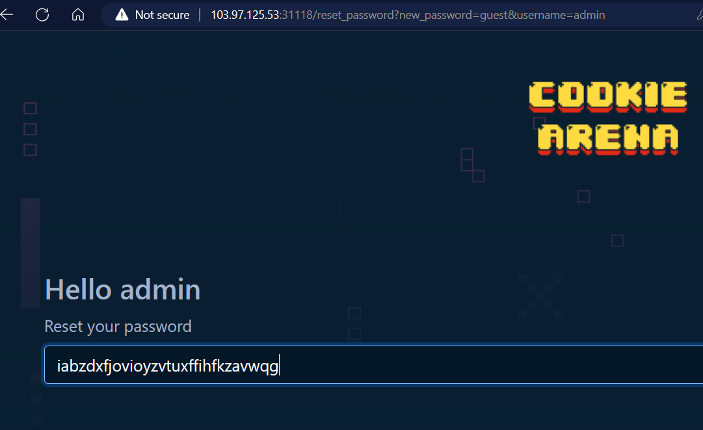

<h1>Password Disclosure</h1>

```python
if request.method == "GET":
    username = request.args.get("username", session.get("username"))
    if not username:
        return redirect("/login")

    conn = get_db()
    user = conn.execute(
        """
            SELECT *
            FROM users
            WHERE username = ?        
        """,
        (username,)
    ).fetchone()
    return render_template("reset_password.jinja2", username=username, password=user["password"])
```

```python
username = request.args.get("username", session.get("username"))
# Nếu giá trị đối số username không tồn tại sẽ lấy giá trị session.get("username") làm đối số.
```

```python
return render_template("reset_password.jinja2", username=username, password=user["password"])
# Truy vấn giá tri username và trả lại password cho client
```



```
FLAG: CHH{pAsSwOrD_DISC10suRe_22e6a69d51cd0a1591d7d1827d29b727}
```