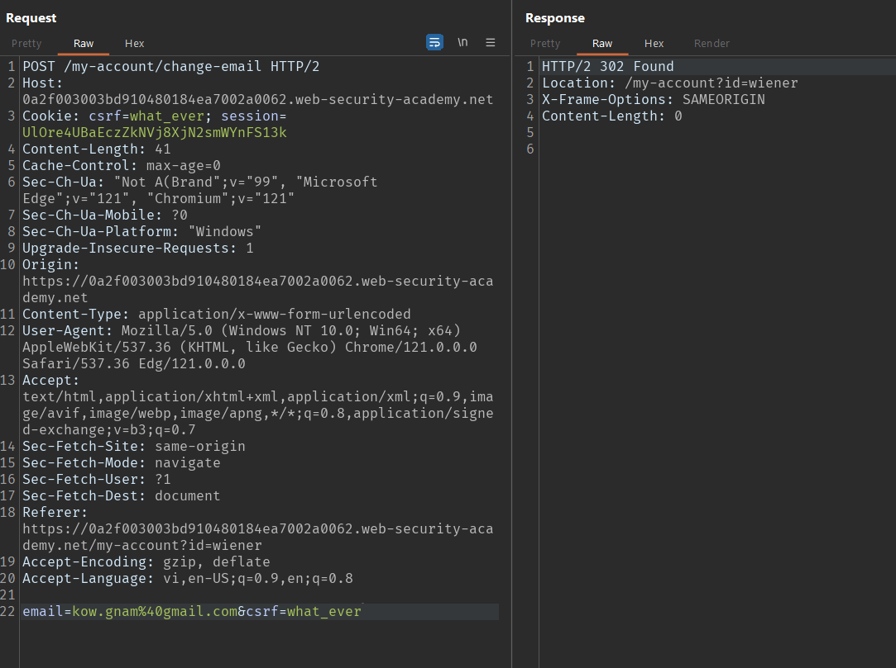
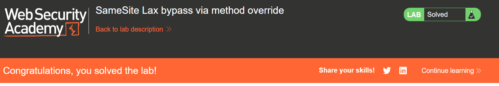

# WEB 03 - CSRF

## Lab 01: CSRF vulnerability with no defenses

Vul ở chức năng thay đổi email

Quan sát:
- Phiên đăng nhập được lưu trong cookie 
- Form change email không có giá trị csrf

=> có thể thực hiện được csrf (Bài lab này không có bất kỳ biện pháp bảo vệ csrf nào, vậy nên không cần test gì nhiều)

Tấn công:

B1: Bắt request thay đổi email:

email thay đổi thành công có status code response: 302

B2: Sử dụng Generate CSRF Poc

B3: Mở exploit-server, paste csrf poc vừa được generate vào body, ấn store và deliver exploit to victim

## Lab 02: CSRF where token validation depends on request method

Vul ở chức năng thay đổi email

Quan sát:

Bắt request load form
- Phiên nằm trong Cookie
- Khi send liên tiếp request ta thấy value csrf không đổi => csrf phụ thuộc vào phiên

Bắt request change email

- Thay đổi method từ POST => GET

- Kết quả đều trả về <b>302 found</b>

Tấn công:

Sử dụng Generate CSRF Poc với method GET

Copy HTML và paste vào body của exploit-server

## Lab 03: CSRF where token validation depends on token being present

VUL: Lab này tồn tại lỗ hổng tại chức năng thay đổi email, server không kiểm tra logic khi mã csrf được truyền vào là rỗng

Khi có mã csrf:

>Kết quả 302 FOUND

Khi không có mã csrf

>Kết quả cũng trả về 302 FOUND

Tấn công:

Sử dụng Generate Csrf Poc với tham số đầu vào không có mã csrf

Copy HTML -> Paste vào body

Store và Deliver exploit to victim

## Lab 04: CSRF where token is not tied to user session

Mã CSRF không bị ràng buộc với phiên của user

Lỗ hổng nằm ở vị trí thay đổi email

Có thể thấy khi bắt request show form change email, mã csrf bị thay đổi sau mỗi lần request => mã CSRF không bị ràng buộc với phiên của user => với mọi mã csrf được trả về và chưa dùng để request lần nào đều hợp lệ với mọi phiên của mọi user

request 1:

request 2:

Tấn công:

Dùng mã csrf của attacker (mã csrf này chưa được sử dụng) đưa vào form và gửi cho victim submit form đó 

Lẫy mã csrf lần đầu:

Sử dụng Generate Csrf Poc

Copy HTML -> Paste vào body

Store và Deliver exploit to victim

## Lab 05: CSRF where token is tied to non-session cookie

Trong lab này, mã csrf bị ràng buộc bởi csrfKey trong cookie nhưng csrfKey lại không bị ràng buộc với phiên của user

Tấn công:

Lấy csrf-key và csrf của attacker chèn vào request và để victim submit

Mã csrf chính là parameter có thể dễ dàng thay đổi

Nhưng csrfKey lưu trong cookie, để có thể thay đổi csrfKey ta cần tìm thêm 1 lỗ hổng khác cho phép thay đổi cookie của user. Lỗ hổng đó nằm ở vị trí tìm kiếm

Những gì tìm kiếm sẽ được set vào cookie qua biến <b>LastSearchTerm</b>

Vậy việc cần làm là ngắt dòng để chèn thêm 1 cookie nữa chứa csrfKey

Triển khai: Generate Csrf Poc

## Lab 06: CSRF where token is duplicated in cookie

Mã csrf trên form change email được xác thực bằng cách so sánh với mã csrf trong cookie, khi 2 chuỗi giống nhau => csrf token valid. 2 chuỗi không giống nhau => csrf token invalid

Và việc mã csrf khi thay đổi tùy ý mà vẫn thành công chứng tỏ mã csrf không phụ thuộc vào phiên

Tương tự như <a href="#lab-05-csrf-where-token-is-tied-to-non-session-cookie">Lab 05</a> Lỗ hổng cho phép thay đổi csrf trong cookie tại chức năng search

Sử dụng Generate Csrf Poc

## Lab 07: SameSite Lax bypass via method override

Lỗ hổng cho phép ghi đè method request

Thay vì submit form thì chỉ cần click vào link của attack

Trước:

Sau:

Solve:

## Lab 08: SameSite Strict bypass via client-side redirect

Lab này được đặt SameSite Strict trong cookie kể từ khi login, không cho phép gửi cookie ra ngoài SameSite

Tại chức năng change email cho phép method GET

Sau khi comment 1 bài viết, sẽ được redirect tới <b>/post/comment/confirmation</b>

Đọc source của <b>/post/comment/confirmation</b> phát hiện sử dụng nối chuỗi => có thể Path traversal tới chức năng change email (vì cùng method GET) để thay đổi email

Solve:

## Lab 09: SameSite Strict bypass via sibling domain

