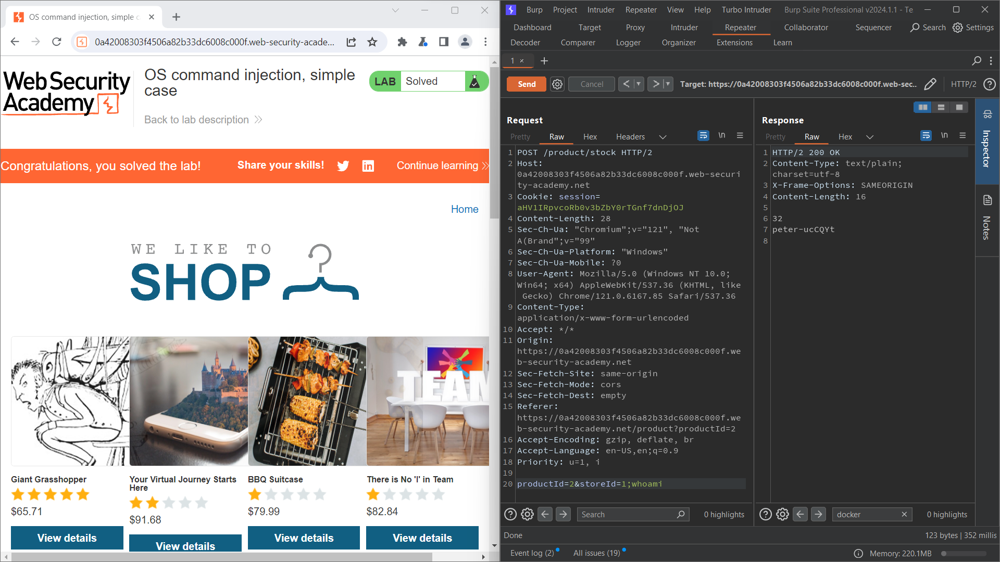
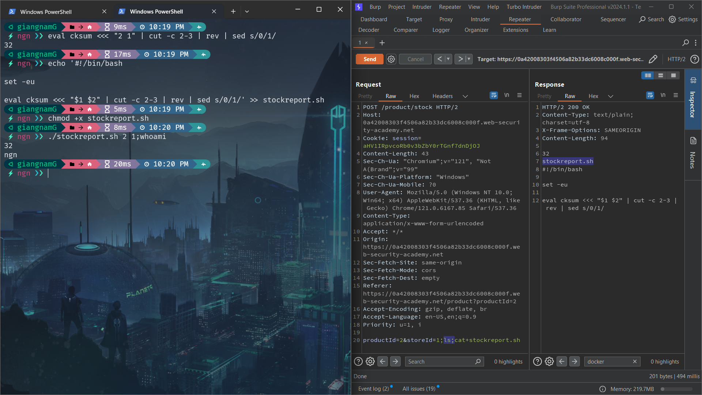
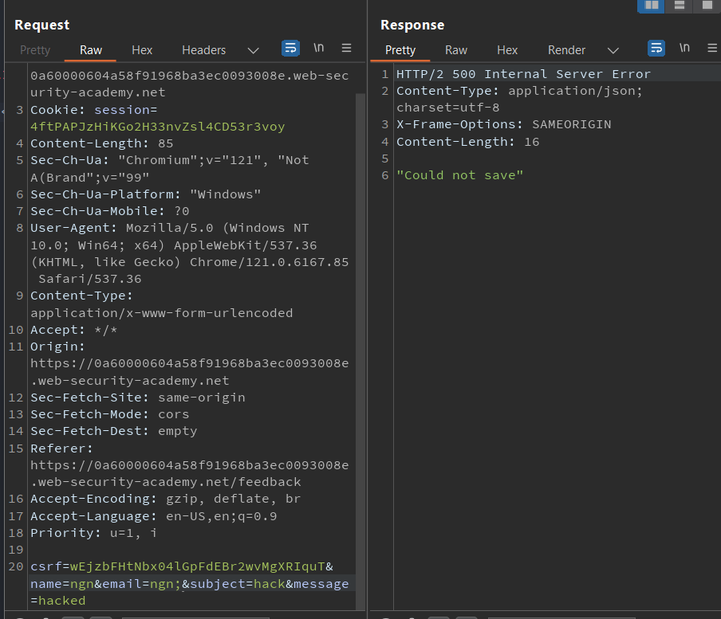
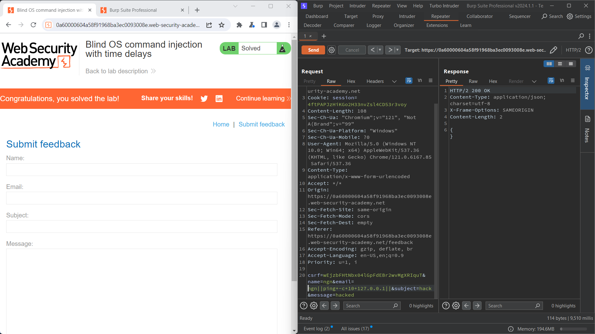
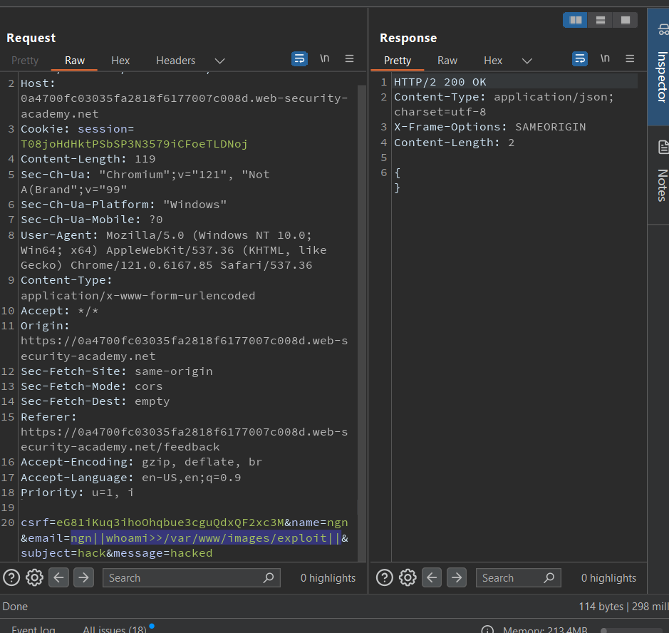
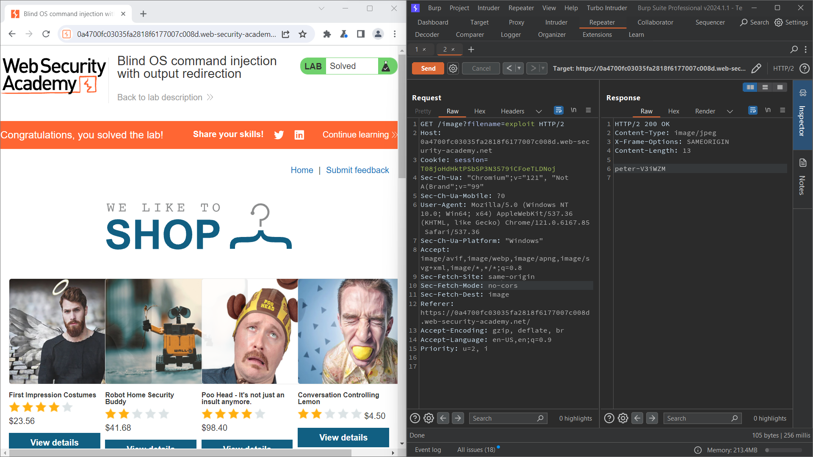

# WEB 06: OS command injection

## Lab 01: OS command injection, simple case

Sử dụng dấu <b>;</b> để ngăn cách 2 câu lệnh





## Lab 02: Blind OS command injection with time delays

Kỹ thuật <b>blind with time delays</b> sử dụng khi inject vào ứng dụng dù bị lỗi hay không bị lỗi cũng không có biểu hiện gì. Vậy sử dụng time delays để nhận biết ứng dụng này đã bị inject thành công khi thời gian response trả về ứng với time delays

Trong bash script:
- dấu lệnh <b>command 1 | command 2</b> để chỉ output của command 1 sẽ là input của command 2
- dấu lệnh <b>command 1 || command 2</b> để chỉ khi command 1 có giá trị thoát khác 0 (bị lỗi) thì command 2 sẽ được thực thi

Tại parameter <b>email</b> khi thêm dấu <b>;</b> ứng dụng thông báo <b>Could not save</b>, dự đoán ở đây đã xảy ra lỗi cú pháp nào đó



Sử dụng dấu lệnh <b>||</b>
```
email=ngn||ping -c 10 127.0.0.1||
```
khi cmd1 là ngn lỗi, nó sẽ thực hiện cmd2 là ping địa chỉ lookup 10 lần tương ứng là 10s



## Lab 03: Blind OS command injection with output redirection 

Trong lab này, sau khi blind inject ta cần xem được output của hành động này là gì. Nhưng ở response tất nhiên sẽ không có gì trả về.

Vậy cách để đọc output là đưa output của lệnh đã thực hiện và 1 file và di chuyển file ấy đến 1 folder có quyền ghi mà chúng ta có thể truy cập được thông qua web server

Folder <b>/var/www/images/</b> là nơi chứa các ảnh của lab cho phép việc ghi file và browser lấy ảnh bằng cách gọi đến <b>GET /image?filename=</b>



Câu lệnh trên đưa output của <b>whoami</b> vào 1 file có tên là exploit ở <b>/var/www/images/</b>

Sau khi send xong, thì truy cập vào file

> GET /image?filename=exploit



## Lab 04: Blind OS command injection with out-of-band interaction

Ứng dụng thực thi lệnh shell chứa các chi tiết do người dùng cung cấp. Lệnh được thực thi không đồng bộ và không ảnh hưởng đến phản hồi của ứng dụng. Không thể chuyển hướng đầu ra đến một vị trí mà ta có thể truy cập. Tuy nhiên, bạn có thể kích hoạt các tương tác out-of-band với miền bên ngoài.

 