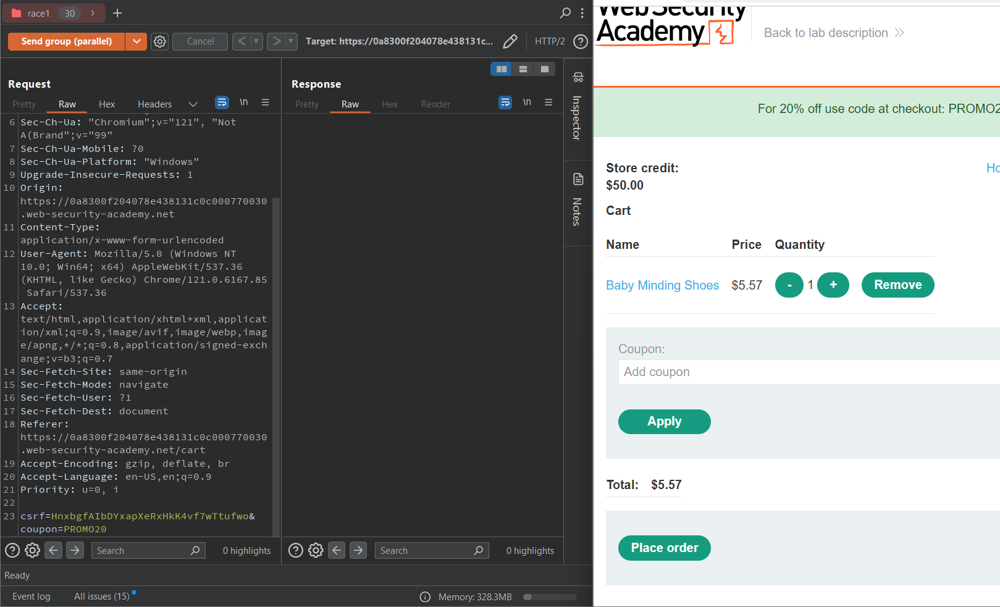
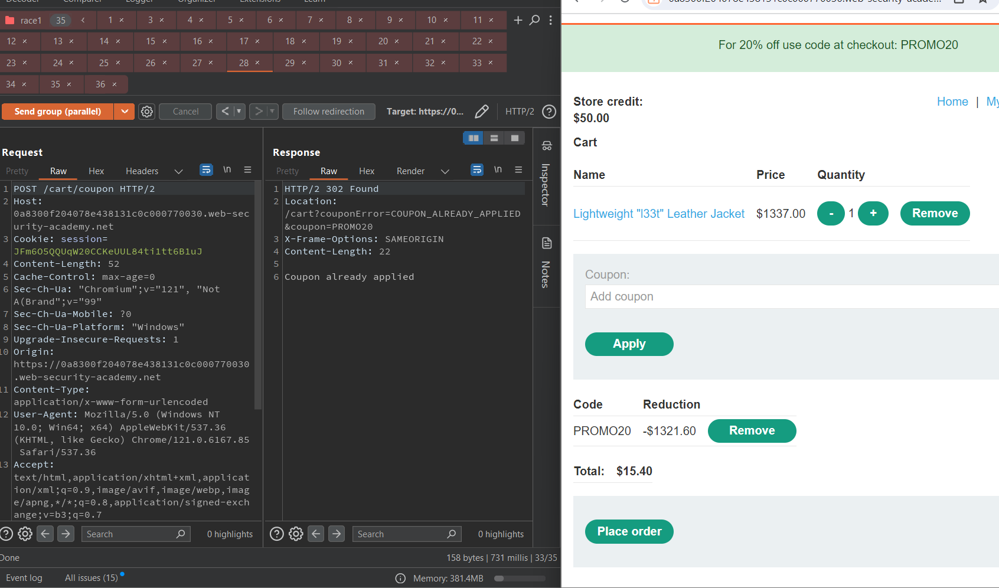
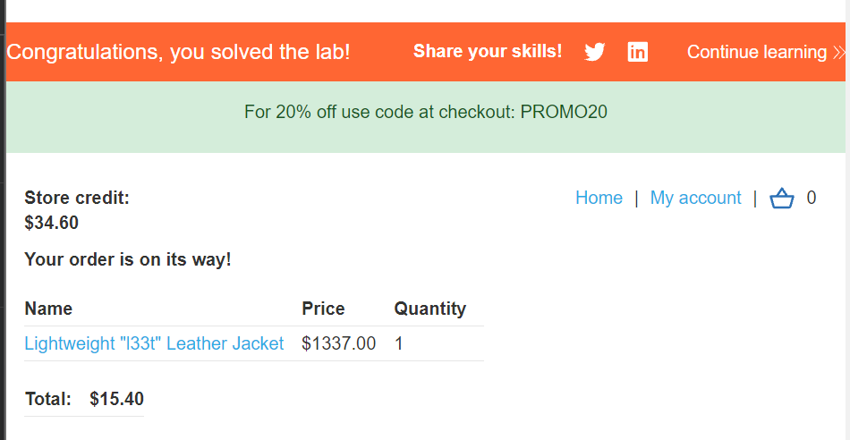

# WEB 04: Race conditions

## Lab 01: Limit overrun race conditions

Đầu tiên, ta thấy khi truy cập vào giỏ hàng và xóa cookie phiên, ta thấy giỏ hàng trống

Suy ra, rất có thể các biến sẽ được lưu vào phiên, do vậy khi áp mã giảm giá mặc dù mỗi request tương ứng với 1 lần áp mã giảm giá nhưng lại giảm trên 1 biến toàn cục

```php
// Giảm giá 20%
if (isset($_POST['coupon']))
    $_SESSION['price'] *= 0.8 
```

Tạo khoảng 35 tab với request áp mã giảm giá

HTTP/2 nên sử dụng <b>send group in parallel</b>



Chọn send





## Lab 02: Bypassing rate limits via race conditions


