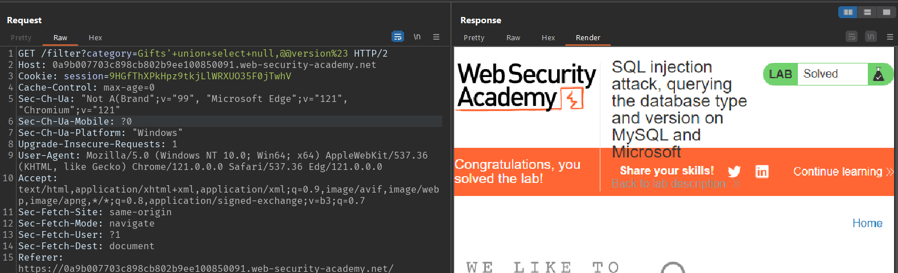
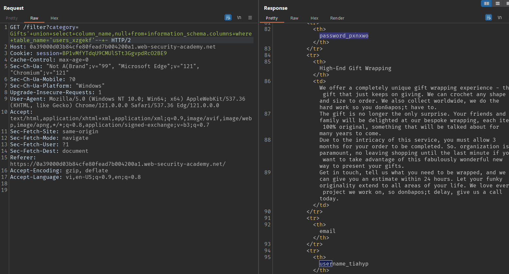

# WEB 01: SQL Injection

## Lab 01: SQL injection vulnerability in WHERE clause allowing retrieval of hidden data


## Lab 02: SQL injection vulnerability allowing login bypass


## Lab 03: SQL injection attack, querying the database type and version on Oracle


## Lab 04: SQL injection attack, querying the database type and version on MySQL and Microsoft



## Lab 05: SQL injection attack, listing the database contents on non-Oracle databases

Cách 1: Không tools

B1: Tìm kiếm bảng chứa users


=> Users table: <b>users_xzgekf</b>

B2: Tìm kiếm tên các cột trong bảng <b>users_xzgekf</b>



Tìm được 2 cột: <b>username_tiahyp</b> và <b>password_pxnxwo</b>

B3: Tìm account admin trong table <b>users_xzgekf</b>


>administrator: mbxe01j7vfka2mpc8705

Cách 2: Sử dụng Sqlmap

Payload:

```powershell
python .\sqlmap.py -u "https://0a1700dc041359d981a75ce500fb0000.web-security-academy.net/filter?category=" -p "category" --dbs --dump
```
Kết quả:


## Lab 06: SQL injection attack, listing the database contents on Oracle

Cách 1: Không tools

Detect ra được csdl là Oracle 


Sử dụng cú pháp sau để dump bảng và cột, cách làm tương tự như <a href="#lab-05-sql-injection-attack-listing-the-database-contents-on-non-oracle-databases">Lab 05</a>
```sql
SELECT table_name FROM all_tables
SELECT column_name FROM all_tab_columns
```
Cách 2: Sử dụng Sqlmap

Payload:
```powershell
python .\sqlmap.py -u "https://0aa2003104116239814557ce00ed001d.web-security-academy.net/filter?category=" -p "category" --dbms=oracle --dump
```
Kết quả:


## Lab 07: SQL injection UNION attack, determining the number of columns returned by the query

Tìm được số cột là 3


## Lab 08: SQL injection UNION attack, finding a column containing text


## Lab 09: SQL injection UNION attack, retrieving data from other tables


## Lab 10: SQL injection UNION attack, retrieving multiple values in a single column

Để retrieving nhiều giá trị từ 1 cột, sử dụng phép nối chuỗi


Csdl sử dụng PostgreSQL => sử dụng cú pháp nối chuỗi của PostgreSQL


## Lab 11: Blind SQL injection with conditional responses

Ứng dụng sử dụng TrackingId trong cookie để theo dõi người dùng khi họ truy cập. 

Nếu TrackingId có trong DB => Thông báo <b>Welcome Back!</b><br>
Ngược lại, không có thông báo nào!

### [DETECT]


Bài cho 1 bảng <b>users</b> có cột <b>username</b> và <b>password</b>. Trong có username=<b>administrator</b>

### [TEST]


Sử dụng <b>Intruder</b> để BruteForce password


Xác định được <b>password</b> dài 20 ký tự

Payload:


Kết quả:


Sắp xếp theo thứ tự từ 1->20 ta được password:

> yjuxiq7m8wg9emo8o8tj


## Lab 12: Blind SQL injection with conditional errors

DB: oracle

Lỗ hổng nằm ở <b>TrackingId</b>


Nếu sai cú pháp, server trả về 500, ngược lại đúng trả về 200

Sử dụng kỹ thuật <b>conditional errors</b>


Tìm độ dài password

Trả về 500 => tìm được độ dài


=> Độ dài 20 ký tự


Tìm mật khẩu


Tham số thứ nhất là vị trí ký tự trong password

Tham số thứ hai là giá trị cần so sánh với giá trị của tham số 1

Nếu khớp server sẽ trả vể 500


Sắp xếp theo thứ tự từ 1->20: ta được nhận password

>09vb1aq3hq0b5w8ue8fc


## Lab 13: Visible error-based SQL injection
>SQLi dựa trên lỗi có thể nhìn thấy được

Ứng dụng sử dụng cookie theo dõi để phân tích và thực hiện truy vấn SQL chứa giá trị của cookie đã gửi. 

Kết quả của truy vấn SQL không được trả về. 

Cơ sở dữ liệu chứa một bảng khác gọi là <b>users</b>, với các cột là tên <b>username</b> và <b>password</b>. Để giải quyết bài lab, hãy tìm cách rò rỉ mật khẩu cho người dùng quản trị viên, sau đó đăng nhập vào tài khoản của họ.

Khi thêm 1 dấu nháy đơn ta thấy server báo lỗi


Khi thêm 1 dấu nháy đơn nữa, ta thấy server không báo lỗi


Do 2 dấu nháy đơn tạo thành chuỗi rỗng


Sử dụng cast để db báo ra lỗi cú pháp convert


## Lab 14: Blind SQL injection with time delays

Ứng dụng sử dụng cookie theo dõi để phân tích và thực hiện truy vấn SQL chứa giá trị của cookie đã gửi. 

Kết quả của truy vấn SQL không được trả về và ứng dụng không phản hồi theo bất kỳ cách nào khác nhau dựa trên việc truy vấn trả về bất kỳ hàng nào hay gây ra lỗi. 

Tuy nhiên, do truy vấn được thực hiện đồng bộ nên có thể kích hoạt độ trễ thời gian có điều kiện để suy ra thông tin. Để giải quyết bài lab, hãy khai thác lỗ hổng SQL SQL để gây ra độ trễ 10 giây.


## Lab 15: Blind SQL injection with time delays and information retrieval
>Blind SQL với độ trễ thời gian và truy xuất thông tin

detect bằng time sleep (postgrep)


Sử dụng dấu ; để ngắt lệnh cũ viết lệnh mới


Khi điều kiện đúng thì delay 20s, khi điều kiện sai thì ko delay

