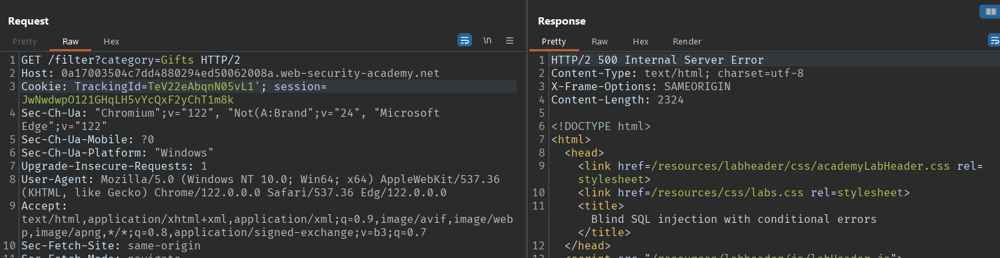

# WEB 01: SQL Injection

## Lab 01: SQL injection vulnerability in WHERE clause allowing retrieval of hidden data


## Lab 02: SQL injection vulnerability allowing login bypass


## Lab 03: SQL injection attack, querying the database type and version on Oracle


## Lab 04: SQL injection attack, querying the database type and version on MySQL and Microsoft


## Lab 05: SQL injection attack, listing the database contents on non-Oracle databases

Cách 1: Không tools

B1: Tìm kiếm bảng chứa users


=> Users table: <b>users_xzgekf</b>

B2: Tìm kiếm tên các cột trong bảng <b>users_xzgekf</b>


Tìm được 2 cột: <b>username_tiahyp</b> và <b>password_pxnxwo</b>

B3: Tìm account admin trong table <b>users_xzgekf</b>


>administrator: mbxe01j7vfka2mpc8705

Cách 2: Sử dụng Sqlmap

Payload:

```powershell
python .\sqlmap.py -u "https://0a1700dc041359d981a75ce500fb0000.web-security-academy.net/filter?category=" -p "category" --dbs --dump
```
Kết quả:


## Lab 06: SQL injection attack, listing the database contents on Oracle

Cách 1: Không tools

Detect ra được csdl là Oracle 


Sử dụng cú pháp sau để dump bảng và cột, cách làm tương tự như <a href="#lab-05-sql-injection-attack-listing-the-database-contents-on-non-oracle-databases">Lab 05</a>
```sql
SELECT table_name FROM all_tables
SELECT column_name FROM all_tab_columns
```
Cách 2: Sử dụng Sqlmap

Payload:
```powershell
python .\sqlmap.py -u "https://0aa2003104116239814557ce00ed001d.web-security-academy.net/filter?category=" -p "category" --dbms=oracle --dump
```
Kết quả:


## Lab 07: SQL injection UNION attack, determining the number of columns returned by the query

Tìm được số cột là 3


## Lab 08: SQL injection UNION attack, finding a column containing text


## Lab 09: SQL injection UNION attack, retrieving data from other tables


## Lab 10: SQL injection UNION attack, retrieving multiple values in a single column

Để retrieving nhiều giá trị từ 1 cột, sử dụng phép nối chuỗi


Csdl sử dụng PostgreSQL => sử dụng cú pháp nối chuỗi của PostgreSQL


## Lab 11: Blind SQL injection with conditional responses

Ứng dụng sử dụng TrackingId trong cookie để theo dõi người dùng khi họ truy cập. 

Nếu TrackingId có trong DB => Thông báo <b>Welcome Back!</b><br>
Ngược lại, không có thông báo nào!

### [DETECT]


Bài cho 1 bảng <b>users</b> có cột <b>username</b> và <b>password</b>. Trong có username=<b>administrator</b>

### [TEST]


Sử dụng <b>Intruder</b> để BruteForce password


Xác định được <b>password</b> dài 20 ký tự

Payload:


Kết quả:


Sắp xếp theo thứ tự từ 1->20 ta được password:

> yjuxiq7m8wg9emo8o8tj


## Lab 12: Blind SQL injection with conditional errors

Lỗ hổng nằm ở <b>TrackingId</b>



Nếu sai cú pháp, server trả về 500, ngược lại đúng trả về 200

Sử dụng kỹ thuật <b>conditional errors</b>


