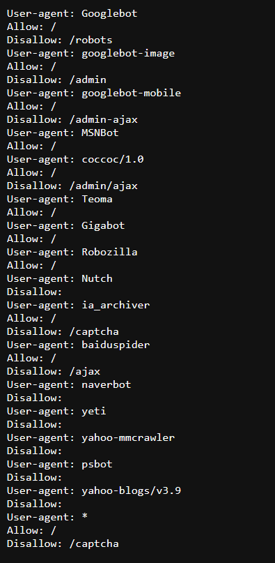
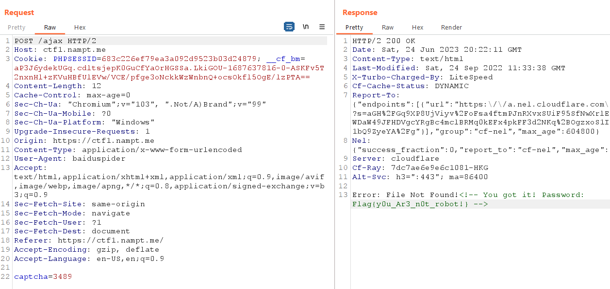

<h1>Are you a robot?</h1>

Kiểm tra /robots.txt

Nội dung file là các user-agent và disallow.

Sử dụng BurpSuite, sửa đổi user-agent: baiduspider và đường dẫn là /captcha. ta nhận được flag.

> flag: Flag{y0u_Ar3_n0t_robot!}