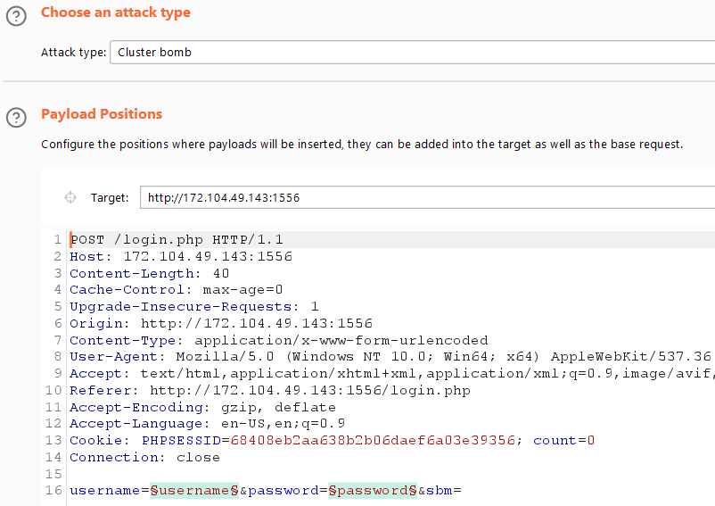
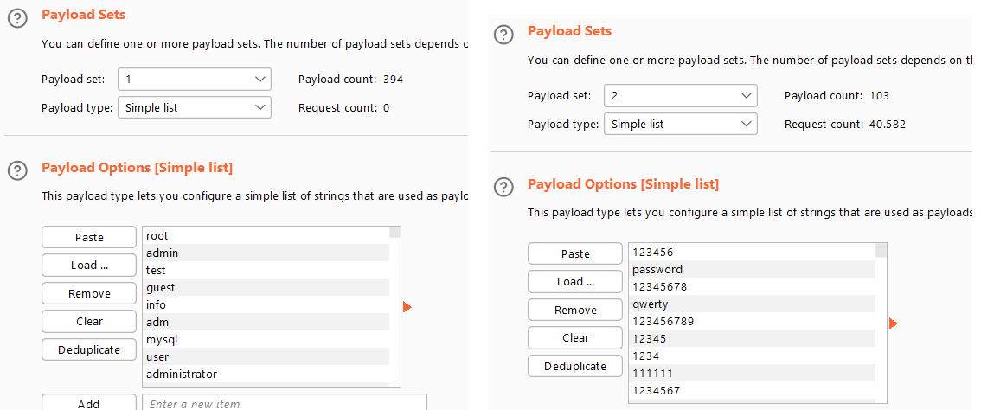
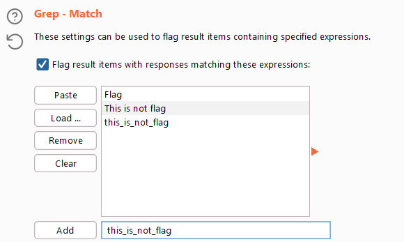
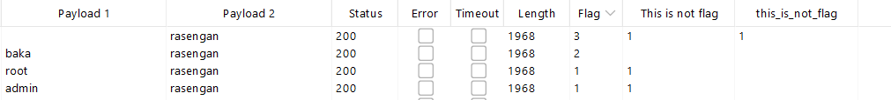

<h1>Do you know Brute Force</h1>

CTRL+U ta tìm được 2 file ẩn <b>/us3rn4me.txt, /p4ssw0rd.txt</b>,
đề bài là brute force có lẽ sẽ lấy từng username, password trong mỗi file ra để submit. Nhưng mỗi file cũng sêm sêm 200 từ => ta cần 200*200 = 40000 lần thử. Sử dụng Intruder trong BurpSuite.

Đầu tiên ta bắt request và send vào Intruder (ctrl + i).

Trong phần Posotions

- Chọn kiểu tấn công: Cluster bomb
- Đặt 2 biến chạy vào <b>username và password</b>

Trong phần Payloads
 

Trong phần Options

- Grep những từ sau 

Quay trở lại nhâns <b>attack</b>

- Chọn request nào mà cột Flag có giá trị, các cột còn lại đều không có giá trị.  
- => request có <b>username = baka</b> và <b>password = rasengan</b>

Cuối cùng là xem response trả về, ta nhận được flag:

> Flag{Brut3_f0rce_s0o_e4sy}