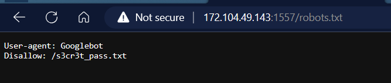
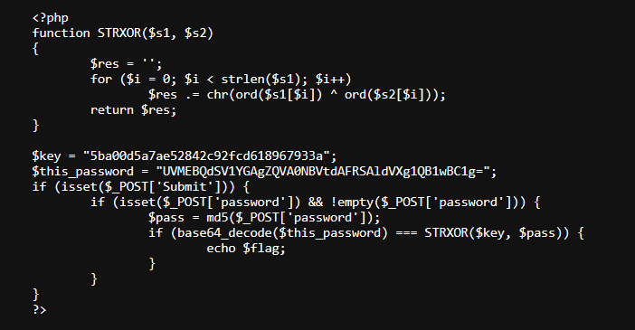

<h1>Easy Password</h1>

<b>Phân tích</b><br>
Try cập vào file <b>robots.txt</b> ta được file <b>/s3cr3t_pass.txt</b> 



Try cập vào file <b>/s3cr3t_pass.txt</b> ta được src code



Nội dung nhập ở ô password bị md5 và lưu vào biến <b>$pass</b>. Kết quả của phép XOR <b>($key, $pass)</b> nếu bằng với <b>base64_decode($this_password)</b> sẽ cho <b>$flag</b>

> Ta có a xor b = c <=> a xor c = b 

Vậy trước hết tiến hành decode base64 <b>$this_password</b> sau đó đem xor với <b>$key</b> ta sẽ thu được giá trị của  <b>$pass</b>.

Nhưng vì <b>$pass</b> được encrypt md5, ta cần 1 số tool hên sui sẽ decrypt được ra dạng plantext để nhập vào ô password.

<b>SOLVE</b>
```python
import base64
key = '5ba00d5a7ae52842c92fcd618967933a'
this_password = 'UVMEBQdSV1YGAgZQVA0NBVtdAFRSAldVXg1QB1wBC1g='
decoded_password = base64.b64decode(this_password.encode('utf-8'))
Input = "".join([chr(ord(key[i])^decoded_password[i]) for i in range(0, len(key))])
print(Input)
```
> Input = d1e576b71ccef5978d221fadf4f0e289 ở dạng md5

Sử dụng tool online hên sui sẽ có flag, nếu không phải nghĩ cách khác :<
[Tại đây](https://md5decrypt.net/en/)

>Decrypt giá trị md5 ở trên ta được plantext: <b>superpassword</b>

Submit <b>superpassword</b> ta được flag: <b>Flag{H4r3m_n0_Jutsu}</b>