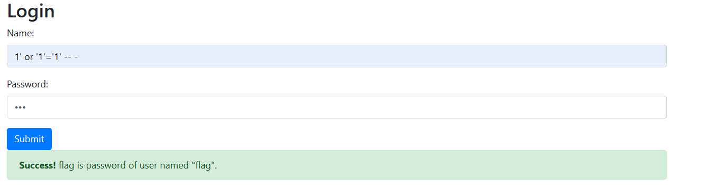
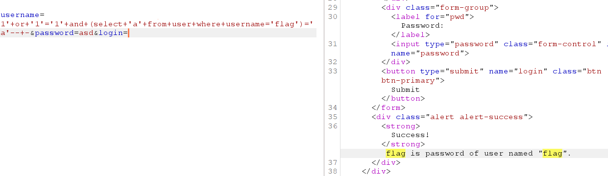
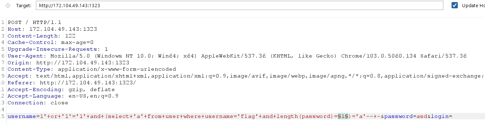
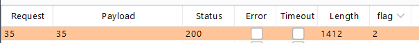
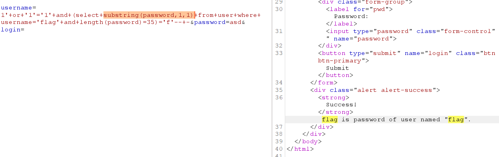
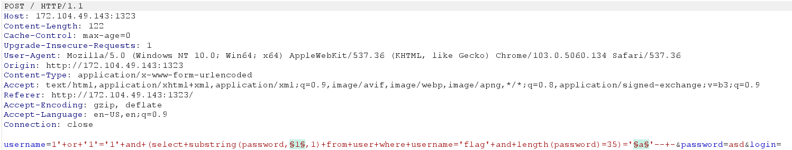
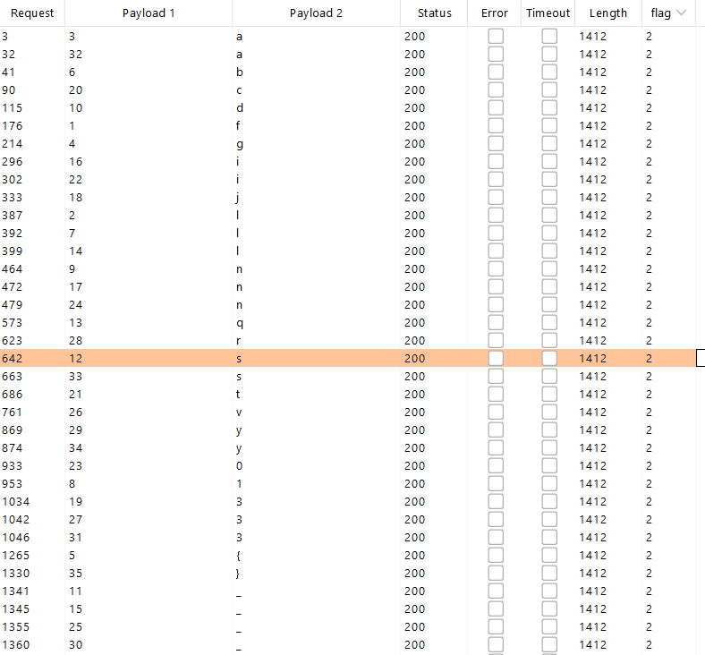

<h1>Login Form</h1>

Kiểm tra lỗi Sql Injection

Flag nằm trong cột password có username là <b>flag</b>

> username=1'+or+'1'='1'+and+(select+'a'+from+user+where+username='flag')='a'--+-

Đây là lỗ hổng SQL BLind

Sử dụng Intruder kiểm tra độ dài <b>Password</b> với payload:

>username=1'+or+'1'='1'+and+(select+'a'+from+user+where+username='flag'+and+length(password)=§1§)='a'--+-&password=asd&login=

- Chọn kiểu tấn công <b>Sniper</b>
- trong phần payload set chọn <b>Numbers</b>
- Thêm <b>Grep-Match</b> với nội dung là: <b>flag</b>

Nhấn nút <b>Attack</b> và quan sát:

=> độ dài của password = 35 ký tự

Tiếp theo
- cắt từng ký tự của password và đem so sánh với character set: <b>abcdefghijklmnopqrstuvwxyz0123456789{}_</b>
- Flag có form: <b>Flag{}</b>, thử với ký tự đầu tiên và so sánh với chữ <b>f</b>:

> username=1'+or+'1'='1'+and+(select+substring(password,1,1)+from+user+where+username='flag'+and+length(password)=35)='f'--+-

Tiếp theo, đưa request vào intruder tiến hành brute force

- Chọn kiểu tấn công <b>Cluster bomb</b>
- Payload 1 là vị trí ký tự đang kiểm tra => payload set chọn kiểu <b>numbers</b>
- Payload 2 là giá trị của ký tự => payload set chọn kiểu brute force <b>abcdefghijklmnopqrstuvwxyz0123456789{}_</b>

Nhấn <b>Attack</b> và quan sát:

Sắp xếp lại payload 2 theo số thứ tự từ 1->35 của payload 1 ta được Flag: <b>flag{bl1nd_sql_inj3cti0n_v3ry_3asy}</b>

Submit flag trên vào web login thì phản hồi nhận được là <b>success</b>, nhưng nộp flag thì lại báo sai. Lý do tại sao thì mình không biết, sau 1 hồi ngồi thử thì flag đúng là thế này: 

<b>Flag{Bl1nd_Sql_Inj3cti0n_V3ry_3asy}</b>