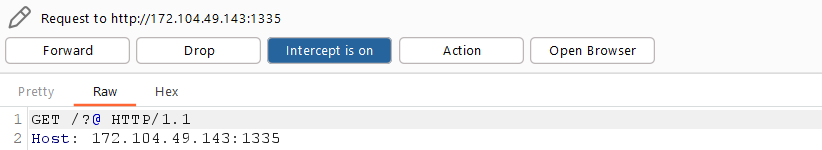
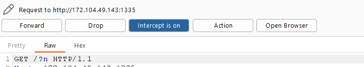

<h1>PHP Up Right It</h1>

Để ý trên URI các ký tự sau được direct từ ký tự trước. Sử dụng BurpSuite để bắt request.

Lần request đầu ta được ký tự <b>'@'</b>

>=> Flag = @

Ấn Forward, ta được ký tự tiếp theo là <b>n</b>

>=> Flag = @n

Tiếp tục Forward cho đến khi lặp lại ký tự <b>@n</b>

Ta thu được chuỗi flag = @nTFlag{URI_is_Import@nT

>Như vậy flag = Flag{URI_is_Import@nT}
