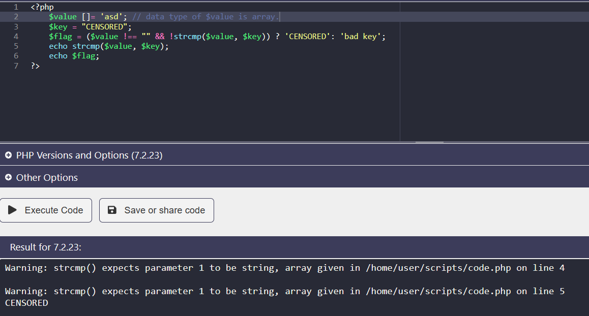
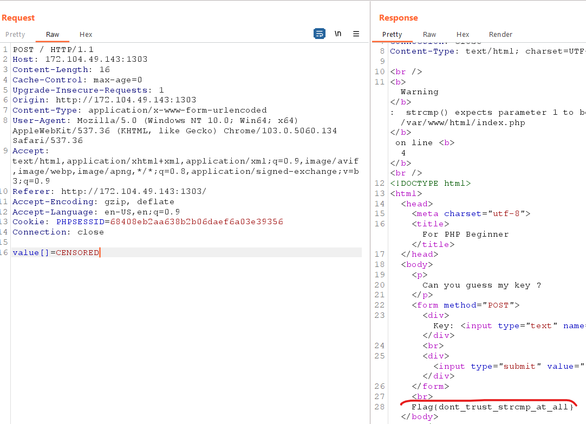

<h1>Tragic pHp</h1>

Khi inspect, ta có file index.phps, đây là chức năng chính của src

```php
<?php
    $value = isset($_POST['value']) ? $_POST['value'] : '';
    $key = "CENSORED";
    $flag = ($value !== "" && !strcmp($value, $key)) ? 'CENSORED': 'bad key';
?>
```
<b>$key</b> mang giá trị nào đó ta không thể đoán được, nên việc nhập input để theo logic code ra flag là không thể nào.

Check version của php là <b>PHP/7.2.23</b>. Ở version này hàm <b>strcmp</b> sẽ trả về <b>0</b> ngay khi 2 chuỗi so sánh khác kiểu dữ liệu và chỉ đưa ra warming.



Như vậy mặc dù chuỗi <b>'asd'</b> khác chuỗi <b>'CENSORED'</b>, nhưng hàm <b>cmpstr</b> vẫn trả về giá trị 0 và <b>$flag = 'CENSORED'</b> vì kiểu dữ liệu 2 biến khác nhau, và chỉ đưa ra cảnh báo.

Áp dụng lỗi đó, ta thay đổi kiểu dữ liệu của input bằng BurpSuite như sau:



> flag: Flag{dont_trust_strcmp_at_all}  